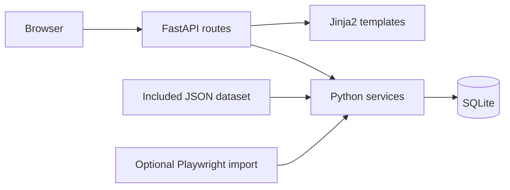

<div align="center">

# WKUCourseKit

A local syllabus and course-material organizer for WKU/Kean students.

[](https://www.python.org/)
[](https://fastapi.tiangolo.com/)
[](#scope-and-data)

</div>

## Overview

WKUCourseKit is a CPS 3320 final project that organizes enrolled courses, syllabus sections, required and optional materials, ISBN records, and print-friendly course packets. It runs locally and ships with a repeatable demonstration dataset.

## Features

- Searchable and filterable **My Courses** view
- Syllabus library and detailed syllabus reader
- Required/optional material checklist with ISBN and source links
- Print center for syllabus packets and material lists
- SQLite database seeded from included JSON
- Optional browser-assisted import from Kean Simple Syllabus after the student signs in directly

## Quick start

Open PowerShell in the repository's `Code` directory:

```powershell
python -m venv .venv
.\.venv\Scripts\Activate.ps1
python -m pip install --upgrade pip
python -m pip install -r requirements.txt
python scripts\seed_db.py
uvicorn app.main:app --reload
```

Visit `http://127.0.0.1:8000`.

Useful routes: `/courses`, `/library`, `/materials`, `/print`, and `/health`.

## Optional syllabus import

```powershell
python -m playwright install chromium
python scripts\sync_simple_syllabus.py
```

The script opens a local browser so the student can sign in on the official site. The application should not receive or store the student's Kean password.

## Architecture



## Included artifacts

```text
Code/                  Application and runtime dataset
Dataset/               Dataset copy and documentation
Results/               Screenshots and result summary
Report PDF/            Final report
Presentation Slides/   Final presentation
README/                Submission copy of the README
```

## Scope and data

The included dataset is for demonstration and contains no private student credentials or textbook files. The optional import must only access records the signed-in student is authorized to view. Before broader use, add tests, explicit retention rules, access controls, and a review of institutional data policies.

## License

No license file is currently included.


